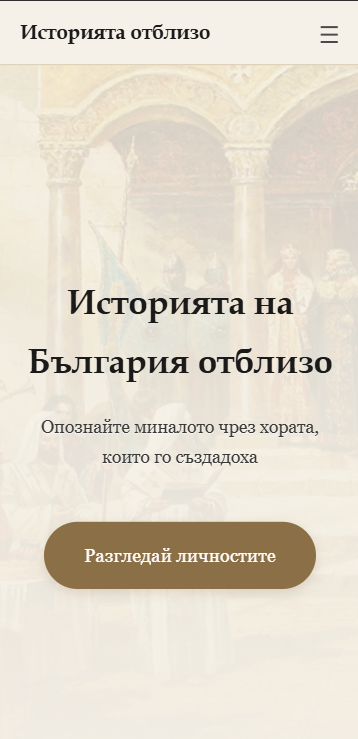

# Историята отблизо

Образователна уеб платформа, посветена на българската история — разказана чрез хората, които я създадоха. Без учебникарска тежест, с разказвателна дълбочина.

 **[Live Demo](#)** — [Istoriataotblizo](https://istoriataotblizo-2abd6.web.app/index.html)

---

## Preview



---

## За проекта

„Историята отблизо" представя ключови личности и събития от българската история по достъпен начин. Потребителят може да разглежда исторически фигури, да чете статии и да следи хронология на събитията.

Проектът е изграден изцяло с чист HTML, CSS и JavaScript.

---

## Функционалности

- **Каталог с личности** — исторически фигури от създаването на България до днес
- **Статии** — ключови събития в разказвателен формат  
- **Хронология** — визуална времева линия
- **Теми** — тематично групирано съдържание
- **Responsive дизайн** — адаптиран за мобилни устройства

---

## Tech Stack


---

## Структура

```
/
├── index.html
├── css/
│   ├── main.css
│   └── home.css
├── js/
│   ├── main.js
│   └── index.js
└── html/
    ├── catalog.html
    ├── themes.html
    ├── timeline.html
    └── about.html
```

---

## Стартиране локално

1. Изтегли репото като ZIP от бутона Code → Download ZIP
2. Разархивирай файловете
3. Отвори index.html в браузър

---

## Автори

Направен в колаборация с @ventsislav67.
